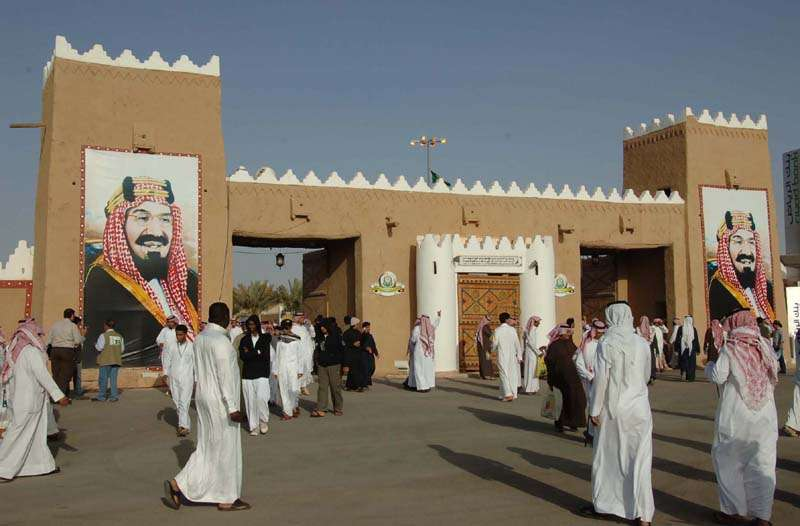
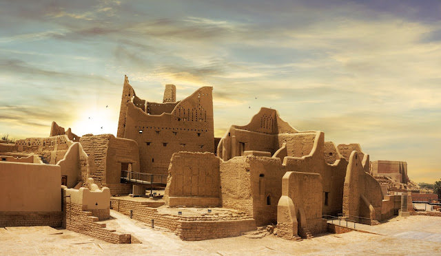
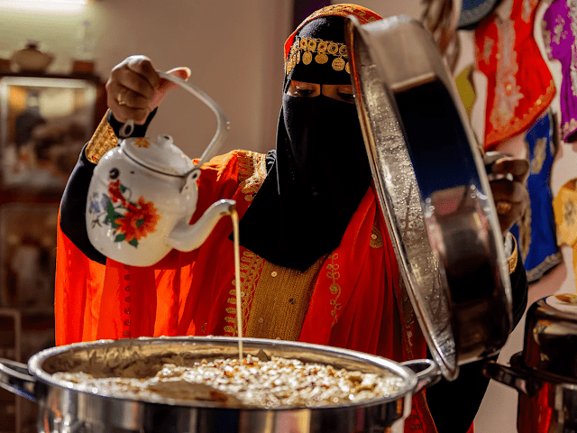

# ll<!DOCTYPE html>
<html>

<head>
    <title>المملكة العربية السعودية</title>
</head>
<body>

<main>
    <h2>التراث السعودي</h2>
    
التراث السعودي يُجسّد الهوية الوطنية للمملكة العربية السعودية، ويعكس تاريخها العريق وثقافتها الغنية المتجذّرة في العادات
    والتقاليد والقيم الأصيلة. وليس التراث مجرد ماضٍ نحتفي به، بل هو مرآة حيّة تنعكس فيها أصالة المجتمع السعودي وتطوّره عبر
    العصور. تتجلّى مظاهره في الفنون الشعبية، والعمارة التقليدية، والملبس، والمأكل، وحتى في تفاصيل الحياة اليومية التي ما
    زالت تحتفظ بروح الماضي في ظل الحاضر المتجدّد.

<h5>التراث الشعبي السعودي يمتد ليشمل العديد من المظاهر التي تميز المجتمع السعودي وتربط الماضي بالحاضر. من أبرز هذه المظاهر:</h5>

<ol>
     <li>الآثار التاريخية</li>
    <li>الأمثال الشعبية</li>
    <li>الفلكلور والأهازيج</li>
    <li>التراث الثقافي غير المادي
    </li>
    <li>الأهازيج</li>
    <li>المأكولات الشعبية</li>
    
   
</ol>

<main>
    <h2>تاريخ المملكةوآثارها</h2>
    
يمتد تاريخ المملكة إلى آلاف السنين، حيث شهدت أرضها قيام حضارات متعاقبة تركت آثارها ومعالمها شاهدةً على عمق التاريخ
    وأهمية الموقع الحضاري لشبه الجزيرة العربية. كما شكّل توحيد المملكة على يد الملك عبدالعزيز  رحمه الله  مرحلةً مفصلية
    أسست لدولة حديثة تجمع بين الأصالة والتطوّر. وتنتشر في مناطق المملكة مواقع أثرية وتاريخية تعكس هذا الإرث العريق وتُبرز
    مكانتها التاريخية. 

    
    <h5>تمثل هذه المعالم صفحاتٍ مضيئة من تاريخ المملكة؛ فالدرعية مهد الدولة السعودية الأولى، وآثار العلا تكشف حضاراتٍ قديمة
    ازدهرت في المنطقة، وقصر المصمك ارتبط بمرحلة التوحيد، بينما تُجسّد النقوش الصخرية في حائل بدايات الاستقرار البشري على أرض
    الجزيرة العربية.</h5>
    <main>
        <h2>التراث الثقافي الغير مادي</h2>
        
لا يقتصر التراث على المباني والآثار، بل يمتد ليشمل الموروث الثقافي غير المادي الذي يتجلّى في الحرف اليدوية، والخياطة
        التقليدية، والنقش، وصناعة السدو، والتطريز، وصياغة الحُلي. هذه الفنون تُنقل من جيلٍ إلى جيل، وتحافظ على الهوية الثقافية
        للمجتمع، كما تعبّر عن الذوق الجمالي والمهارة والإبداع المتوارث. 

            

            <h5>يمثل التراث غير المادي روح المجتمع السعودي؛ حيث تُظهر الحرف التقليدية مثل السدو والتطريز والنقش مهارة الحرفيين واعتزازهم
            بموروثهم الثقافي، ودورهم في حفظ هذا الإرث للأجيال القادمة.</h5>
            <main>
                <h2>الأكل الشعبي في المملكة</h2>
                
يتميّز المطبخ السعودي بتنوّعه بتنوّع مناطق المملكة، حيث تعبّر كل منطقة عن بيئتها وثقافتها من خلال أطباقها التقليدية.
                فالطعام جزءٌ أصيل من التراث الاجتماعي، يعكس قيم الكرم وحسن الضيافة، ويجتمع حوله الأهل والأقارب في المناسبات والاحتفالات.

                
                <h5>تجسّد الأطباق الشعبية مثل الكبسة والجريش والمندي روح الضيافة السعودية، وتعكس تنوّع الموروث الغذائي الذي توارثته الأجيال
                جيلاً بعد جيل.</h5>
                <h4>زر مدونتي لمزيد من التفاصيل عن التراث السعودي</h4>

<a href="https://www.saudiheritage.it.com/"> التراث السعودي</a>

</body>

</html>
